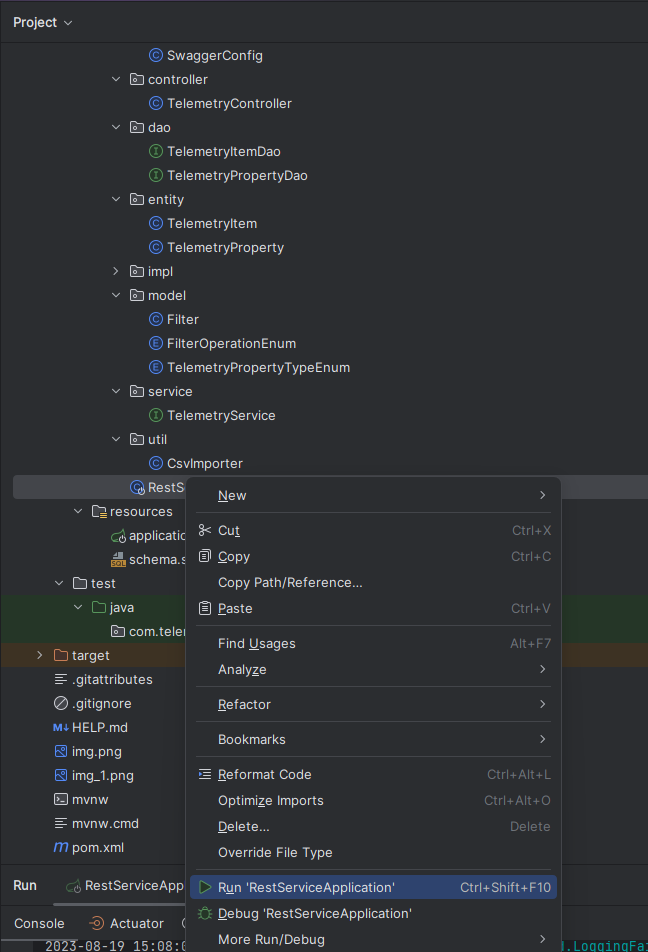

# rest-service
This is simple app that is processing CSV files and importing rows into in memory H2 database.

## Starting from IDE
### Prerequisites
1. IDE of your choice
2. Maven 3+
3. JDK 11

### How to start
1. Import project into your IDE
2. Create maven run configuration with goal clean install

3. Start your maven run configuration you have just created. Build should pass.
4. Find RestServiceApplication.java in your project tree. Right click. Run.



## DB
In memory H2 DB is used. schema.sql is read on startup and database is set up.

DB consists of two tables. 


This can be optimized furthermore:

1. Create vehicle table with ID and Serial Number and create a relation to property_item via id.
Benefit: In case of changing SN, all telemetry data will get new values
2. Create telemetry_property_definition table that will have property_name and type. Then create a relation to telemetry_property and telemetry_property_definition
3. Using some king of DB versioning system, like [LiquiBase](https://www.liquibase.org/)

## CSV parsing

All CSV files starting with LD_A and LD_C are parsed, one by one.
Parsing can be optimized by implementing parsing in batches of rows and/or threads.

First the header is read. Each row in csv represents single telemetry item. Property values are dynamically assigned from column headers.

If column is date, it will be parsed as integer for the query purpose. Integer from date value represent timestamp in ms.

If column is boolean, there are multiple possible values: true, "Yes", "Active", "On", 1. If Column is specified as boolean but another value is provided, it will be treated as FALSE.

If value of the field is "NA", it is omitted from writing into DB

### Parsing headers

For each header there is a parsing process
1. Everything is removed in between [], including square brackets. This will remove unit from the header
2. All special characters are replaced with empty space
3. Convert Words To PascalCase
4. Remove all spaces

Example:
Ambient temperature [°C] -> AmbientTemperature

### Moving Processed Files
After the file is processed, it will be moved into PROCESSED subfolder

## DAO
This layer can be optimized by using Page and Pageable.
For more info check these links:

[Page](https://docs.spring.io/spring-data/commons/docs/current/api/org/springframework/data/domain/Page.html)

[Pageable](https://docs.spring.io/spring-data/commons/docs/current/api/org/springframework/data/domain/Pageable.html)

# Endpoints

Once the application is started, endpoints will be available on port 8080 by default. To change the port, please check application.properties

To check all available endpoints, use [swagger](http://localhost:8080/swagger-ui.html#) once the application is started, or use this postman collection: [Telemetry.postman_collection.json](Telemetry.postman_collection.json)

## Base URL

The base URL for all the endpoints is: `http://localhost:{PORT}`

## Endpoints

### 1. Import CSV

Imports CSV files from the directory described in application.properties as `telemetry.source.csv.root`

- **Endpoint:** `/importCsv`
- **Method:** GET
- **Parameters:** None

### 1. Filter

Get details about telemetry items with specified filters.

- **Endpoint:** `/filter`
- **Method:** POST
- **Parameters:** None
- **Body**
  ```json
  [
      {
        "field": "SerialNumber",
        "value": "A5304997"
      },
      {
        "field": "DateTime",
        "operation": "LessThan",
        "value": "Mar 31, 2023, 6:00:00 AM"
      },
      {
        "field": "AllWheelDriveStatus",
        "value": false
      }
  ]

#### Filters!
Each filter can have 
1. field
   - String representation of the header, in PascalCase, without special characters or measurement unit.
         If CSV header is `Ambient temperature [°C]` , then the filter field will be `AmbientTemperature`
2. operation
   - String representation for operation. If omitted, `Equals` will be used. 
   Possible values:
      1. `Equals` - Applicable for all types
      2. `GreaterThan` - Applicable for Integer, Decimal and Date
      3. `LessThan` - Applicable for Integer, Decimal and Date
      4. `Contains` - Applicable for String
3. value
   - filter value in corresponding format:
      1. `Date` - String representation of the date in this format: `"Mar 31, 2023, 6:00:00 AM"`
      2. `Integer` - Integer value must be supplied in integer format. Example: `4` will work, but `"4"` will not work
      3. `Float` - Decimal value must be supplied in decimal format. Example: `1.5` will work, but `"1.5"`  will not work
      4. `String` - String value for the filter
      5. `Boolean` - Possible values are `true`, `"true"`,`1`, `"Yes"`, `"Active"`, `"On"`. Everything else is considered false, including `"1"`
- **Response:**
  ```json
  [
    {
        "SpeedFrontPto": "0",
        "GpsLatitude": "45.3649462",
        "EngineSpeed": "749",
        "CoolantTemperature": "35",
        "MachineType": "Tractor",
        "AmbientTemperature": "10.59",
        "ActualStatusOfCreeper": "No",
        "EngineLoad": "52",
        "AllWheelDriveStatus": "No",
        "DateTime": "Mar 31, 2023, 5:59:27 AM",
        "GroundSpeedGearbox": "2.74",
        "SerialNumber": "A5304997",
        "GpsLongitude": "20.4154291",
        "CurrentGearShift": "5",
        "TransverseDifferentialLockStatus": "0",
        "SpeedRearPto": "0",
        "TotalWorkingHoursCounter": "1185.45",
        "FuelConsumption": "3.9",
        "ParkingBrakeStatus": "3"
    },
    {
        "SpeedFrontPto": "0",
        "GpsLatitude": "45.3649839",
        "EngineSpeed": "1033",
        "CoolantTemperature": "35",
        "MachineType": "Tractor",
        "AmbientTemperature": "10.59",
        "ActualStatusOfCreeper": "No",
        "EngineLoad": "40",
        "AllWheelDriveStatus": "No",
        "DateTime": "Mar 31, 2023, 5:59:37 AM",
        "GroundSpeedGearbox": "5.11",
        "SerialNumber": "A5304997",
        "GpsLongitude": "20.4153116",
        "CurrentGearShift": "5",
        "TransverseDifferentialLockStatus": "0",
        "SpeedRearPto": "0",
        "TotalWorkingHoursCounter": "1185.45",
        "FuelConsumption": "4.05",
        "ParkingBrakeStatus": "3"
    },
    {
        "SpeedFrontPto": "0",
        "GpsLatitude": "45.3650186",
        "EngineSpeed": "1162",
        "CoolantTemperature": "36",
        "MachineType": "Tractor",
        "AmbientTemperature": "10.59",
        "ActualStatusOfCreeper": "No",
        "EngineLoad": "64",
        "AllWheelDriveStatus": "No",
        "DateTime": "Mar 31, 2023, 5:59:47 AM",
        "GroundSpeedGearbox": "5.8",
        "SerialNumber": "A5304997",
        "GpsLongitude": "20.4151243",
        "CurrentGearShift": "5",
        "TransverseDifferentialLockStatus": "0",
        "SpeedRearPto": "0",
        "TotalWorkingHoursCounter": "1185.45",
        "FuelConsumption": "5.95",
        "ParkingBrakeStatus": "3"
    },
    {
        "SpeedFrontPto": "0",
        "GpsLatitude": "45.3650846",
        "EngineSpeed": "1406",
        "CoolantTemperature": "37",
        "MachineType": "Tractor",
        "AmbientTemperature": "10.59",
        "ActualStatusOfCreeper": "No",
        "EngineLoad": "62",
        "AllWheelDriveStatus": "No",
        "DateTime": "Mar 31, 2023, 5:59:57 AM",
        "GroundSpeedGearbox": "6.89",
        "SerialNumber": "A5304997",
        "GpsLongitude": "20.4149342",
        "CurrentGearShift": "5",
        "TransverseDifferentialLockStatus": "0",
        "SpeedRearPto": "0",
        "TotalWorkingHoursCounter": "1185.46",
        "FuelConsumption": "7.2",
        "ParkingBrakeStatus": "3"
    }
  ]


## Other
1. There is just one application.properties file. Multiple files can be added for different environments so that spring-boot profiles can be utilized
2. Not Everything is covered with Unit tests.
3. There is no authentication of any kind. Everyone can write or read from DB with this solution
4. There is no secret management implemented of any kind. DB user and pass are in application.properties in plain text!
5. Exception handling can be way better. [Exception Handling](https://spring.io/blog/2013/11/01/exception-handling-in-spring-mvc). My choice is @ControllerAdvice
6. Custom Exceptions can be created, and generally handling pieces of code where log.error + return is used